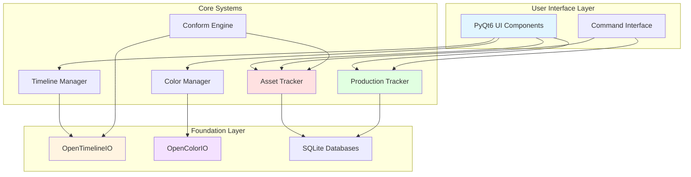
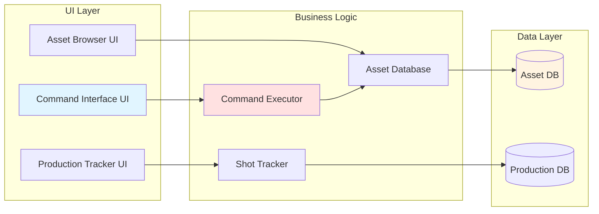

# Conformity Architecture

Comprehensive technical architecture documentation for the Conformity post-production pipeline management system.

## Table of Contents

- [System Overview](#system-overview)
- [Architecture Principles](#architecture-principles)
- [Module Structure](#module-structure)
- [Data Flow](#data-flow)
- [Integration Points](#integration-points)
- [Database Schema](#database-schema)
- [Technology Stack](#technology-stack)
- [Design Patterns](#design-patterns)

## System Overview

Conformity is a modular post-production pipeline management system built on industry-standard tools (OpenTimelineIO, OpenColorIO) with a modern Python architecture.



### Key Characteristics

- **Modular Design**: Independent, loosely-coupled modules
- **Database-Driven**: SQLite for reliable data persistence
- **Industry Standards**: Built on OTIO and OCIO
- **Extensible**: Clear interfaces for adding features
- **Testable**: Comprehensive test suite with 80%+ coverage

## Architecture Principles

### 1. Separation of Concerns

Each module has a single, well-defined responsibility:

- **Asset Tracker**: Media asset management
- **Production Tracker**: Workflow and shot tracking
- **Timeline Manager**: Timeline operations (OTIO)
- **Color Manager**: Color pipeline (OCIO)
- **Conform Engine**: Timeline import/export
- **Command Interface**: Natural language queries

### 2. Dependency Inversion

High-level modules don't depend on low-level modules. Both depend on abstractions:

```
UI Components → Interface → Core Systems → Database
```

### 3. Open/Closed Principle

Modules are open for extension but closed for modification:

- Add new command types without changing executor
- Add new color spaces via OCIO config
- Add new timeline formats via OTIO adapters

### 4. Database-Centric

All persistent data flows through SQLite databases:

- Asset metadata and relationships
- Production tracking and status
- Ensures data integrity with ACID transactions
- Easy backup and versioning

## Module Structure

### Directory Layout

```
conformity/
├── src/conformity/
│   ├── core/                      # Foundation
│   │   ├── config.py             # Configuration management
│   │   └── logger.py             # Logging system
│   │
│   ├── asset_tracker/            # Asset Management
│   │   ├── asset_database.py    # SQLite database (CRUD)
│   │   ├── asset_scanner.py     # Directory scanning
│   │   └── timeline_analyzer.py # Timeline-asset linking
│   │
│   ├── production_tracker/       # Production Workflow
│   │   ├── production_database.py  # SQLite database
│   │   └── shot_tracker.py         # Workflow manager
│   │
│   ├── conform_engine/           # Timeline Operations
│   │   ├── conform_engine.py    # Import/export
│   │   ├── timeline_manager.py  # OTIO operations
│   │   ├── edl_utils.py         # EDL parsing
│   │   └── exceptions.py        # Custom exceptions
│   │
│   ├── timeline_editor/          # Advanced Editing
│   │   ├── edit_operations.py   # Ripple/Roll/Slip/Slide
│   │   ├── clip_operations.py   # Split/Trim/Copy/Paste
│   │   └── track_operations.py  # Track management
│   │
│   ├── color_manager/            # Color Pipeline
│   │   ├── color_manager.py     # Holistic manager
│   │   ├── ocio_manager.py      # OCIO integration
│   │   └── color_pipeline.py    # Processing pipeline
│   │
│   ├── lut_manager/              # LUT Management
│   │   ├── lut_loader.py        # CUBE/3DL parsing
│   │   └── lut_manager.py       # Library management
│   │
│   ├── commands/                 # Natural Language Interface
│   │   ├── command_parser.py    # Query parsing
│   │   ├── command_executor.py  # Execution engine
│   │   └── command_history.py   # History/saved queries
│   │
│   ├── ui_components/            # PyQt6 Widgets
│   │   ├── conform_panel.py           # Conform UI
│   │   ├── color_space_widget.py      # Color UI
│   │   ├── command_interface.py       # Command UI
│   │   ├── production_tracker_widget.py  # Production UI
│   │   └── timeline_widget.py         # Timeline UI
│   │
│   └── demo/                     # Demo Mode
│       └── demo_mode.py          # Pre-populated demo
│
├── tests/                        # Test Suite
│   ├── conftest.py              # Pytest fixtures
│   ├── test_integration.py      # Integration tests
│   └── test_end_to_end.py       # E2E tests
│
├── docs/                         # Documentation
└── config/                       # Configuration
```

### Module Dependencies



## Data Flow

### Asset Tracking Flow

```
User                Asset Browser UI     Asset Scanner      Asset Database     File System
 |                        |                    |                   |                |
 |--Scan directory------->|                    |                   |                |
 |                        |--scan_directory--->|                   |                |
 |                        |                    |--List files------>|                |
 |                        |                    |<--File list-------|                |
 |                        |                    |                   |                |
 |                        |        For each file:                  |                |
 |                        |                    |--Extract metadata-|                |
 |                        |                    |--add_asset()----->|                |
 |                        |                    |<--asset_id--------|                |
 |                        |<--Scan results-----|                   |                |
 |<--Display assets-------|                    |                   |                |
 |                        |                    |                   |                |
 |--Search assets-------->|                    |                   |                |
 |                        |--search_assets(filters)--------------->|                |
 |                        |<--Matching assets---------------------|                |
 |<--Display results------|                    |                   |                |
```

### Production Tracking Flow

```
User            Production UI      Shot Tracker     Production DB
 |                   |                  |                 |
 |--Create shot----->|                  |                 |
 |                   |--add_shot()----->|                 |
 |                   |                  |--create_shot()->|
 |                   |                  |<--shot_id-------|
 |                   |<--shot_id--------|                 |
 |                   |                  |                 |
 |--Start VFX------->|                  |                 |
 |                   |--start_vfx()---->|                 |
 |                   |                  |--update_status->|
 |                   |<--Success--------|                 |
 |                   |                  |                 |
 |--Submit review--->|                  |                 |
 |                   |--submit_review()->                 |
 |                   |                  |--update_status->|
 |                   |                  |--create_review->|
 |                   |<--review_id------|                 |
 |                   |                  |                 |
 |--Approve shot---->|                  |                 |
 |                   |--approve_shot()->|                 |
 |                   |                  |--update_review->|
 |                   |                  |--update_status->|
 |                   |<--Approved-------|                 |
```

## Integration Points

### OTIO Integration

OpenTimelineIO provides timeline interchange:

```python
# Timeline import
import opentimelineio as otio

timeline = otio.adapters.read_from_file("edit.xml")

# Access structure
for track in timeline.tracks:
    for clip in track.each_clip():
        print(f"Clip: {clip.name}")
        print(f"Duration: {clip.duration()}")
        print(f"Media: {clip.media_reference.target_url}")

# Timeline export
otio.adapters.write_to_file(timeline, "output.edl")
```

**Supported Formats:**
- EDL (CMX 3600)
- Final Cut Pro XML
- AAF (Advanced Authoring Format)
- OTIO native format

### OCIO Integration

OpenColorIO provides color management:

```python
import PyOpenColorIO as ocio

# Load configuration
config = ocio.Config.CreateFromFile("config.ocio")

# Get color spaces
for cs in config.getColorSpaces():
    print(f"Color Space: {cs.getName()}")

# Create processor
processor = config.getProcessor("ACES - ACEScg", "sRGB")

# Apply transform (via GPU or CPU)
```

**Color Spaces Supported:**
- ACES (Academy Color Encoding System)
- Rec.709 (HD television)
- sRGB (Standard RGB)
- Custom spaces via OCIO config

### Database Integration

SQLite provides data persistence:

```python
import sqlite3

# Connection with WAL mode for concurrency
conn = sqlite3.connect("assets.db")
conn.execute("PRAGMA journal_mode=WAL")

# Row factory for dict results
conn.row_factory = sqlite3.Row

# Transactions for atomicity
cursor = conn.cursor()
cursor.execute("BEGIN")
try:
    cursor.execute("INSERT INTO assets ...")
    cursor.execute("INSERT INTO metadata ...")
    conn.commit()
except Exception as e:
    conn.rollback()
    raise
```

## Database Schema

### Asset Database Schema

```
┌─────────────────────────────────────┐
│            assets                   │
├─────────────────────────────────────┤
│ id (PK)                            │
│ file_path (UNIQUE)                 │
│ asset_type                         │
│ status                             │
│ created_at                         │
│ updated_at                         │
└─────────────────────────────────────┘
         │
         │ 1:N
         ▼
┌─────────────────────────────────────┐
│          metadata                   │
├─────────────────────────────────────┤
│ id (PK)                            │
│ asset_id (FK)                      │
│ key                                │
│ value                              │
└─────────────────────────────────────┘

┌─────────────────────────────────────┐
│            tags                     │
├─────────────────────────────────────┤
│ id (PK)                            │
│ asset_id (FK)                      │
│ tag                                │
└─────────────────────────────────────┘
```

### Production Database Schema

```
┌──────────────┐
│   projects   │
├──────────────┤
│ id (PK)      │
│ name         │
│ budget       │
│ ...          │
└──────────────┘
      │
      │ 1:N
      ▼
┌──────────────┐
│  sequences   │
├──────────────┤
│ id (PK)      │
│ project_id   │
│ name         │
└──────────────┘
      │
      │ 1:N
      ▼
┌──────────────────────────────────┐
│           shots                  │
├──────────────────────────────────┤
│ id (PK)                         │
│ sequence_id (FK)                │
│ shot_name                       │
│ editorial_status                │
│ vfx_status                      │
│ color_status                    │
│ sound_status                    │
│ finishing_status                │
│ delivery_status                 │
│ ...                             │
└──────────────────────────────────┘
      │
      │ 1:N
      ▼
┌──────────────┐
│    tasks     │
├──────────────┤
│ id (PK)      │
│ shot_id (FK) │
│ title        │
│ status       │
│ ...          │
└──────────────┘

┌──────────────┐
│   reviews    │
├──────────────┤
│ id (PK)      │
│ shot_id (FK) │
│ status       │
│ ...          │
└──────────────┘
```

## Technology Stack

### Core Technologies

| Technology | Version | Purpose |
|------------|---------|---------|
| Python | 3.11+ | Primary language |
| PyQt6 | 6.6+ | GUI framework |
| SQLite | 3.x | Database |
| OpenTimelineIO | 0.16+ | Timeline interchange |
| OpenColorIO | 2.3+ | Color management |

### Supporting Libraries

| Library | Purpose |
|---------|---------|
| PyYAML | Configuration files |
| Pydantic | Data validation |
| pytest | Testing framework |
| pytest-cov | Coverage reporting |
| pytest-xdist | Parallel testing |

### Development Tools

| Tool | Purpose |
|------|---------|
| black | Code formatting |
| flake8 | Linting |
| mypy | Type checking |

## Design Patterns

### 1. Repository Pattern

Database access abstracted through repository classes:

```python
class AssetDatabase:
    """Repository for asset data."""

    def add_asset(self, file_path, asset_type):
        """Create operation."""

    def get_asset(self, asset_id):
        """Read operation."""

    def update_asset_status(self, asset_id, status):
        """Update operation."""

    def search_assets(self, **filters):
        """Query operation."""
```

### 2. Facade Pattern

Simplified interfaces for complex subsystems:

```python
class ShotTracker:
    """Facade for production tracking."""

    def __init__(self, db_path):
        self.db = ProductionDatabase(db_path)

    def start_vfx(self, shot_id, vendor):
        """High-level VFX workflow."""
        self.db.update_shot_status(shot_id, Department.VFX, 'in_progress')
        self.db.update_shot(shot_id, vfx_vendor=vendor)
```

### 3. Strategy Pattern

Interchangeable algorithms for timeline formats:

```python
# OTIO adapters provide different strategies
timeline = otio.adapters.read_from_file("edit.edl")  # EDL strategy
timeline = otio.adapters.read_from_file("edit.xml")  # XML strategy
timeline = otio.adapters.read_from_file("edit.aaf")  # AAF strategy
```

### 4. Observer Pattern

Qt signals/slots for event handling:

```python
class CommandInterfaceWidget(QWidget):
    # Signals (observable events)
    command_executed = pyqtSignal(str, object)
    results_ready = pyqtSignal(list)

    def execute_command(self):
        result = self.executor.execute(command)
        self.command_executed.emit(query, result)  # Notify observers
```

## Performance Considerations

### Database Optimization

1. **Indexes**: Created on frequently queried columns
2. **WAL Mode**: Write-Ahead Logging for concurrent access
3. **Prepared Statements**: Prevent SQL injection, improve performance
4. **Batch Operations**: Group related operations in transactions

### Memory Management

1. **Lazy Loading**: Load timeline clips on demand
2. **Database Cursors**: Stream large result sets
3. **Cleanup**: Explicit resource cleanup in fixtures

### Caching

1. **OCIO Processor Cache**: Reuse color transform processors
2. **Asset Metadata Cache**: In-memory cache for frequently accessed data
3. **Command History**: Limited size with LRU eviction

## Security Considerations

### SQL Injection Prevention

All database operations use parameterized queries:

```python
# Good - parameterized
cursor.execute("SELECT * FROM assets WHERE id = ?", (asset_id,))

# Bad - string interpolation (never do this)
cursor.execute(f"SELECT * FROM assets WHERE id = {asset_id}")
```

### Path Traversal Prevention

File paths validated before use:

```python
def safe_path(base_dir, user_path):
    """Ensure path stays within base directory."""
    full_path = (base_dir / user_path).resolve()
    if not full_path.is_relative_to(base_dir):
        raise SecurityError("Path traversal detected")
    return full_path
```

### Input Validation

Pydantic models validate all configuration:

```python
class ProjectConfig(BaseModel):
    name: str = Field(..., min_length=1, max_length=255)
    budget: float = Field(..., ge=0)
    target_completion: date
```

## Extension Points

### Adding New Color Spaces

1. Update OCIO configuration file
2. No code changes required
3. Config automatically discovered

### Adding New Timeline Formats

1. Implement OTIO adapter (if not existing)
2. Register with OTIO
3. Conform engine automatically supports it

### Adding New Command Types

1. Add pattern to `CommandParser`
2. Add handler to `CommandExecutor`
3. Update documentation

### Adding New UI Widgets

1. Subclass `QWidget`
2. Connect to backend via signals/slots
3. Register in main window

## References

- [OpenTimelineIO Documentation](https://opentimelineio.readthedocs.io/)
- [OpenColorIO Documentation](https://opencolorio.readthedocs.io/)
- [PyQt6 Documentation](https://www.riverbankcomputing.com/static/Docs/PyQt6/)
- [SQLite Documentation](https://www.sqlite.org/docs.html)

---

**Architecture Version**: 1.0.0
**Last Updated**: 2025-11-08
**Authors**: Conformity Development Team
